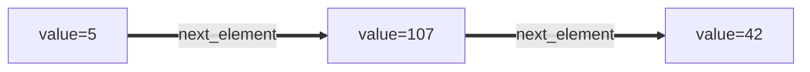
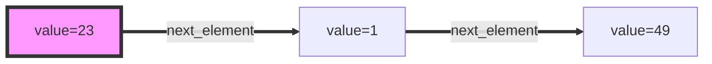
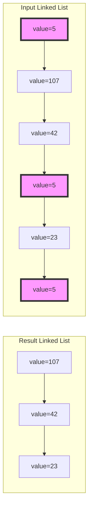
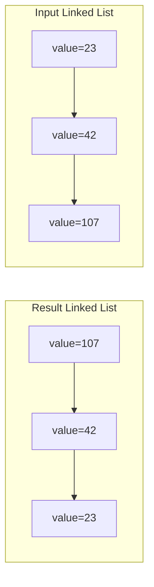
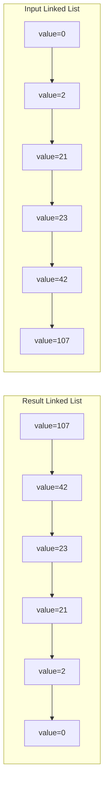
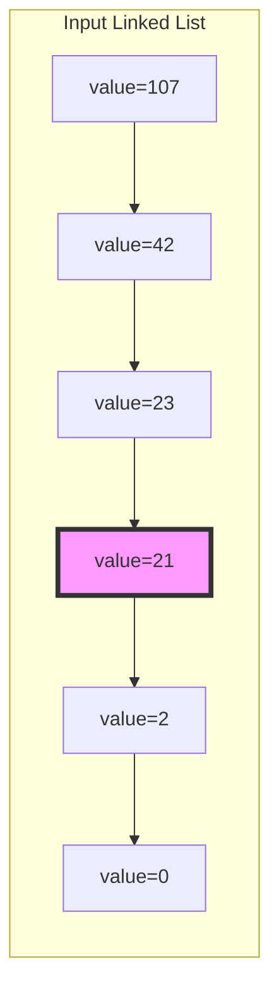
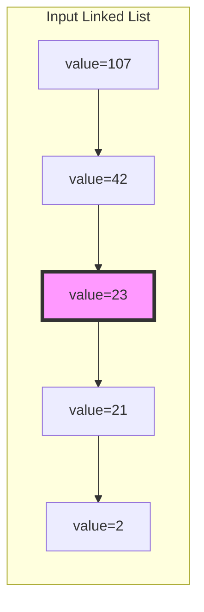

# Linked List

## Purpose

The following coding exercises are designed to test your knowledge of the following concepts:
* Basic data structure for elements of linked lists
* Operations with linked lists

## Overview

The coding exercises cover the following practical problems:
* Creating a linked list using given values
* Removing elements of a linked list by value
* Reversing a linked list
* Finding the middle element of a linked list

## Coding exercises

### Exercise 1: Create a linked list using a given array of values

#### Elements of linked lists

The following snippet contains the very basic data structure that could be used to represent elements of linked lists. Of course, the class can be expanded with additional information if necessary.

```python
class LinkedListNode:
    """Dataclass that represents linked list elements."""

    def __init__(
        self,
        value: int = 0,
        next_element: Optional['LinkedListNode'] = None
    ):
        self.value = value
        self.next_element = next_element
```

Assume that, for all programming assignments in this set of coding exercises, the following data class
will be used to represent elements of linked lists. The implementation above can be found in the `tasks/linked_list_node.py` file.

For example, the following linked list can be created using the snippet below:



```python
a = LinkedListNode(value=42)
b = LinkedListNode(value=107, next_element=a)
c = LinkedListNode(value=5, next_element=b)
```

#### Problem statement

Given an array of values, return a linked list with the initial values (its head element).

**Example:**

Input: [23, 1, 49]

Expected result:


<br/>

Please use the template `tasks/linked_list:create_linked_list` for the implementation.

### Exercise 2: Remove elements of linked list by value

Given the `head` of a linked list and an integer `value`, remove all the nodes of the linked list that have `LinkedListNode.value == value`, and return *the new head*.


**Example 1:**



Here and in the examples below the element to remove is `42`. 

**Example 2:**

Input: [42, 42, 42]

Expected result: []


**Example 3:**

Input: []

Expected result: []

<br/>

Please use the template `tasks/linked_list:remove_values` for the implementation.


### Exercise 3: Reverse a given linked list

Given the `head` of a linked list, reverse the list, and return the head of the reversed list.


**Example 1:**



**Example 2:**



**Example 3:**

Input: []

Expected result: []

<br/>

Please use the template `tasks/linked_list:reverse_linked_list` for the implementation.


### Exercise 4: Find the middle node of a given linked list

Given the `head` of a linked list, return *the middle node of the linked list*.

If there are two middle nodes, return **the second middle** node.

**Example 1:**



**Example 2:**



**Example 3:**

Input: []

Expected result: []

<br/>

Please use the template `tasks/linked_list:get_middle_node` for the implementation.
