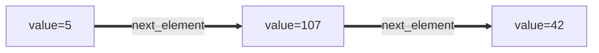
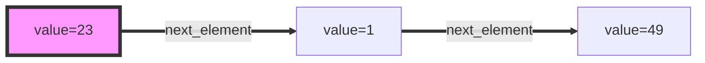
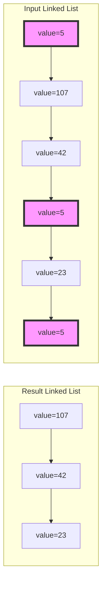
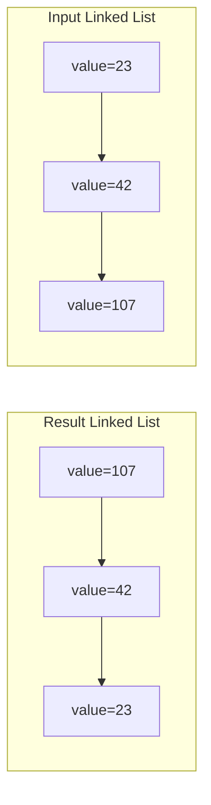
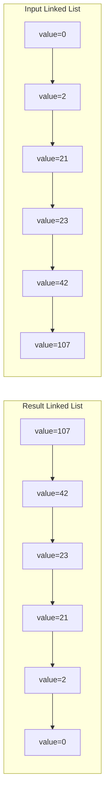
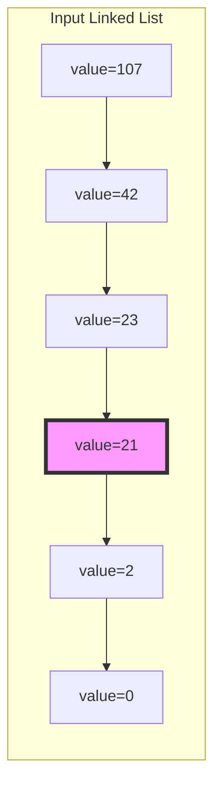
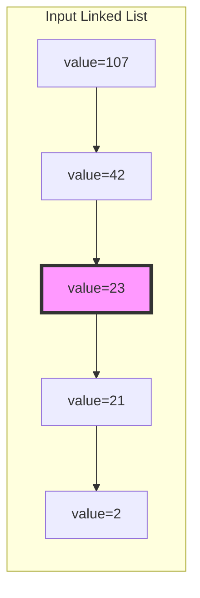

# Linked List (Python)

Set of programming assignments that are designed to test knowledge of linked list data structure.

### Basic data structure for representing linked list

You may assume that for all programming assignments within this problem set the following data class
will be used to represent elements of linked list:

```python
class LinkedListNode:
    """Dataclass that represents linked list elements."""

    def __init__(
        self,
        value: int = 0,
        next_element: Optional['LinkedListNode'] = None
    ):
        self.value = value
        self.next_element = next_element
```

The implementation above can be found within `tasks/linked_list_node.py` file.

For example the following linked list could be created using the snippet below:



```python
a = LinkedListNode(value=42)
b = LinkedListNode(value=107, next_element=a)
c = LinkedListNode(value=5, next_element=b)
```


## Problem 1: Create Linked List using a given array of values

Given an array of values, return a linked list with all the values (its head element).

**Example:**

Input: [23, 1, 49]

Expected result:


Please use a template for the implementation (`tasks/linked_list:create_linked_list`).


## Problem 2: Remove Linked List elements by value

Given the `head` of a linked list and an integer `value`, remove all the nodes of the linked list that has `LinkedListNode.value == value`, and return *the new head*.


**Example 1:**



**Example 2:**

Input: [42, 42, 42]

Expected result: []


**Example 3:**

Input: []

Expected result: []

Please use a template for the implementation (`tasks/linked_list:remove_values`).


## Problem 3: Reverse a given Linked List

Given the `head` of a linked list, reverse the list, and return the reversed list's head.


**Example 1:**



**Example 2:**



**Example 3:**

Input: []

Expected result: []


Please use a template for the implementation (`tasks/linked_list:reverse_linked_list`).


## Problem 4: Find the middle node of a given linked list

Given the `head` of a linked list, return *the middle node of the linked list*.

If there are two middle nodes, return **the second middle** node.

**Example 1:**



**Example 2:**



**Example 3:**

Input: []

Expected result: []


Please use a template for the implementation (`tasks/linked_list:get_middle_node`).
